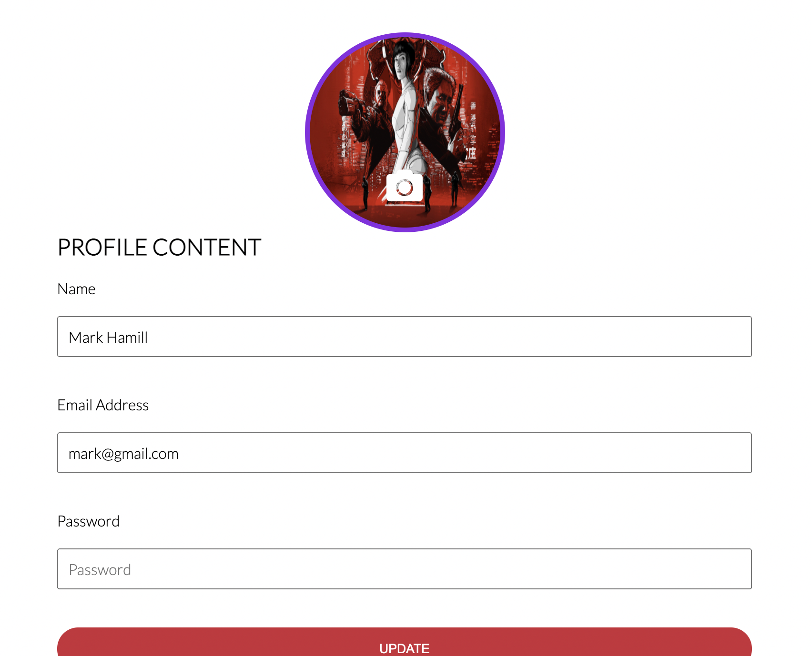

# ManagerAppAng

This project was generated with [Angular CLI](https://github.com/angular/angular-cli) version 11.2.2.

## Development server

Run `ng serve` for a dev server. Navigate to `http://localhost:4200/`. The app will automatically reload if you change any of the source files.

# Manager-App 

## Welcome to manager App

This is an app for testing and improving purposes. Please this is not a fully functional app, is just an experimental application for fun. 

##  API

### The backend is hosted by heroku.

[Traversy-Media](https://manager-app-v2.herokuapp.com "Visit the Api")

## To access the application you have to be either registerd or logged in.

### ONCE YOU ARE SUCESFULLY LOGGED IN

Click in the ADD Navigation button and provide

* Name: Required
* Theme: Selected by default

 
  
 

## Once the new Space is created you will be redirected. 

Select your new workspace and add a new list. 

 
 

### You can mark as checked the todos drag them and drop them.

 
 

## Profile
In this section you can upload a picture and update your personal data.

# MORE FEATURES COMING SOON